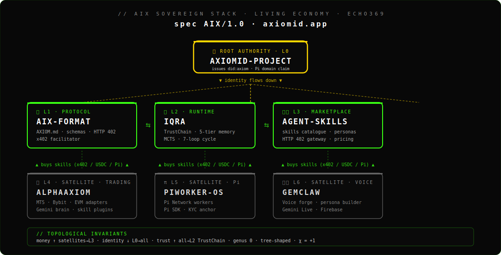
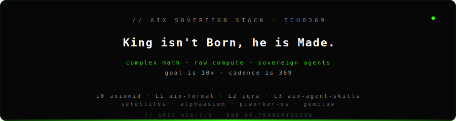

<!-- ════════════════ AIX SOVEREIGN STACK · UNIFIED BRANDING ════════════════ -->

<div align="center">
  
</div>

<div align="center">

[](https://github.com/Moeabdelaziz007/aix-format/blob/main/AXIOM.md)
[](https://github.com/Moeabdelaziz007/aix-format/blob/main/AXIOM.md)
[](https://github.com/Moeabdelaziz007/aix-agent-skills)
[](./package.json)
[](#architecture)
[](./LICENSE)

</div>

<div align="center">

[](#-architects--visionaries)

</div>

<div align="center">

**Sovereign Stack** &nbsp;·&nbsp; [**← L1 · PROTOCOL · `aix-format`**](https://github.com/Moeabdelaziz007/aix-format) &nbsp;·&nbsp; [**← L2 · RUNTIME · `iqra`**](https://github.com/Moeabdelaziz007/iqra) &nbsp;·&nbsp; **🟢 L3 · MARKETPLACE · `aix-agent-skills` · YOU ARE HERE**

</div>

<div align="center">

<sub>Root Authority · [**L0 · `axiomid-project` ↑**](https://github.com/Moeabdelaziz007/axiomid-project) &nbsp;·&nbsp; Satellites · [**L4 · `AlphaAxiom` ↓**](https://github.com/Moeabdelaziz007/AlphaAxiom) &nbsp;·&nbsp; [**L5 · `PiWorker-OS` ↓**](https://github.com/Moeabdelaziz007/PiWorker-OS) &nbsp;·&nbsp; [**L6 · `GemClaw` ↓**](https://github.com/Moeabdelaziz007/GemClaw)</sub>

</div>

<br/>

<!-- ════════════════ /AIX SOVEREIGN STACK ════════════════ -->

# IQRA Agentic Marketplace 🌌

<div align="center">
  
  
  
  
</div>

Welcome to the **Agentic Marketplace** for [IQRA](https://github.com/Moeabdelaziz007/iqra): the supreme multi-agent AI operating system.

This repository is not a mere directory of scripts; it is a **secure, sovereign, and self-evolving cognitive ecosystem**. By combining the supreme architectural sovereignty of IQRA with rigorous security paradigms, we have built a marketplace where every skill is battle-tested, every persona is forged with precision, and every memory is immutable.

---

## 🌐 THE STACK | المنظومة المتكاملة

`aix-agent-skills` is **L3** of the AIX Sovereign Stack: the capability marketplace whose skills are signed against the [`aix-format`](https://github.com/Moeabdelaziz007/aix-format) protocol and orchestrated at execution time by the [`iqra`](https://github.com/Moeabdelaziz007/iqra) runtime. Around the stack sits a **root authority** (L0) and a tier of **satellite layers** (L4-L6) that buy skills from this marketplace via x402.

<div align="center">
  
</div>

### Sovereign Stack (the three core repos)

| Layer | Repo | Role | Status |
|:---:|:---|:---|:---:|
| ⚪ **L1** | [`aix-format`](https://github.com/Moeabdelaziz007/aix-format) | **Protocol** · Universal Agent Passport · DID · Manifest · ABOM · TrustChain | [→ Read](https://github.com/Moeabdelaziz007/aix-format) |
| ⚪ **L2** | [`iqra`](https://github.com/Moeabdelaziz007/iqra) | **Runtime** · Sovereign AI OS · 7 Loops · MCTS · Damir · MissionControl | [→ Read](https://github.com/Moeabdelaziz007/iqra) |
| 🟢 **L3** | [`aix-agent-skills`](https://github.com/Moeabdelaziz007/aix-agent-skills) | **Marketplace** · 9 Layers · Constitutional · TrustChain | **You are here** |

> The three repositories are **one project in three layers**. The protocol is the contract, the runtime is the engine, the marketplace is the catalog. Same constitution, same TrustChain, same palette, same author.

### Extended Ecosystem (root authority + satellites)

Outside the strict L1/L2/L3 chain sits the root authority and a tier of satellite layers. They consume the stack and ride the protocol; they do NOT define it. See [`AXIOM.md §4.5`](https://github.com/Moeabdelaziz007/aix-format/blob/main/AXIOM.md) for the full doctrine and [`AIX_STACK_VERSIONING.md`](https://github.com/Moeabdelaziz007/aix-format/blob/main/AIX_STACK_VERSIONING.md) for the independent-SemVer + `Echo369` codename rule.

| Tier | Repo | Role |
|:---:|:---|:---|
| 👑 **L0** | [`axiomid-project`](https://github.com/Moeabdelaziz007/axiomid-project) | **Root Authority** · sole issuer of `did:axiom:axiomid.app:*` · proprietary |
| 💹 **L4** | [`AlphaAxiom`](https://github.com/Moeabdelaziz007/AlphaAxiom) | **Satellite · Trading** · MT5/Bybit/EVM adapters · skill plugin runtime |
| π **L5** | [`PiWorker-OS`](https://github.com/Moeabdelaziz007/PiWorker-OS) | **Satellite · Pi** · Pi Network workers · Pi SDK · KYC anchor |
| 🎙️ **L6** | [`GemClaw`](https://github.com/Moeabdelaziz007/GemClaw) | **Satellite · Voice** · voice forge · Gemini Live · Firebase |

---

## 🛒 Buy a Skill (Phase 6 . x402 gateway)

The marketplace is reachable over the [x402 protocol](https://www.x402.org/).
A buyer (typically an autonomous agent in L4/L5/L6) requests a skill
manifest, the gateway responds with `402 Payment Required` plus an x402
payload, the buyer signs and re-requests with the `X-PAYMENT` header,
the configured facilitator settles the payment on-chain, and the
manifest is streamed back. Round trip on Base settles in about one
second.

```bash
# Discovery (free):
curl https://skills.axiomid.app/
curl https://skills.axiomid.app/skills

# Paid manifest (400ms after payment settles):
curl https://skills.axiomid.app/skills/agent-memory/manifest
# -> 402 Payment Required, X-PAYMENT-REQUIRED: { "price": "$0.10", "network": "base", ... }

# Re-request with a signed X-PAYMENT header:
curl -H "X-PAYMENT: <base64-payload>" \
     https://skills.axiomid.app/skills/agent-memory/manifest
# -> 200 OK, X-PAYMENT-RESPONSE: { ... }, body: the skill markdown
```

Free skills (no `price_usdc` in `skills.json` or set to `0`) bypass the
402 round trip entirely. The gateway source lives under
[`server/`](./server) (Hono on Cloudflare Workers); see
[`server/README.md`](./server/README.md) for local development,
deployment, and configuration. Initial paid catalogue (Phase 6
baseline): `agent-memory`, `voice-wizard`, `aix-schema`,
`api-route-standard`, `skills-system`. Every other skill remains free
while the economy bootstraps.

## 🔥 The Sovereign Innovation Loop

The marketplace thrives on a continuous cycle of creation, testing, and evolution:
1. **Creation & Forging**: Skills and Personas are dynamically crafted, drawing from vast repositories of curated intelligence.
2. **The Crucible (Testing & Security)**: Before any skill breathes life, it is isolated in sandboxes, subjected to ethical hacking (Red Teaming), and rigorously evaluated across multiple models.
3. **Sovereign Execution**: Verified skills join the IQRA topology, orchestrated flawlessly, governed by an absolute constitution, and leaving an immutable TrustChain trace.

---

<a id="architecture"></a>

## 🏛️ The 9 Sovereign Layers & 58 Core Skills

We currently host an expansive suite of capabilities structured into 9 profound layers (numbered 0 through 8) across 6 tiers. The 58 figure is a core-catalogue snapshot; for the authoritative live total, see the [Live Ecosystem Dashboard](#-live-ecosystem-dashboard) below.

### 0. The Sovereignty Layer (السيادة والدستور)
The absolute core. This layer acts as the living conscience of the agent. Skills here cannot be overridden.
- `sovereign-constitution`: The ethical filter and ultimate reference.
- `covenant-guard`: The digital oath binding the agent to truth and service.
- `shura-council`: The consensus mechanism preventing algorithmic dictatorship.

### 1. The Orchestration Layer (التنسيق والقيادة)
The conductors of the symphony. Managing how skills interact and evolve.
- `topology-orchestrator`: Maps and routes execution paths.
- `skill-bank-evolution`: Autonomous discovery and self-healing of skills.
- `mission-control`: The strategic planner for every task.
- `pipeline-store`: Installable, pre-composed skill chains.
- `version-guard`: Prevents downstream breakages when skills evolve.
- `intent-dispatcher`: Translates natural language directly into execution topologies.

### 2. The Intelligence Layer (الذكاء والاستدلال)
The cognitive engine.
- `prompt-weaver`: Crafts perfect prompts using the 7-thread philosophy.
- `resonance-engine`: Detects hidden patterns and harmonic frequencies between ideas.
- `mcts-simulator`: Monte Carlo Tree Search for strategic forecasting.

### 3. The Evolution Layer (الذاكرة والتطور)
Where data becomes wisdom.
- `memory-bridge`: A 5-tier memory architecture (Hot to Archive).
- `metamorphosis-loop`: Cognitive shedding every 49 tasks.
- `reward-engine`: Evaluates the purity of the execution path, not just the result.

### 4. The Identity Layer (الهوية والأدوار)
The soul, voice, and marketplace of personas.
- `persona-forge`: Forges distinct digital personalities.
- `role-tribunal`: Enforces permission boundaries.
- `voice-identity`: A unique vocal signature reflecting the persona.
- `persona-marketplace`: A vast library of ready-to-use specialized agents.
- `agent-division-loader`: Loads entire functional teams (e.g., Engineering, Creative) for complex missions.
- `multi-tool-exporter`: Exports IQRA personas to external platforms.

### 5. The Data Layer (البيانات والتحليل)
The alchemists of information.
- `data-alchemist`: Transforms raw data into visual gold.
- `model-council`: Routes tasks optimally between Local, Edge, and Cloud models.
- `edge-whisperer`: Empowers offline WebGPU/WASM intelligence.

### 6. The Security Layer (الأمان والثقة)
The immune system and red team.
- `trust-chain`: Immutable, append-only ledger for absolute accountability.
- `circuit-breaker`: Isolates repeated failures before they spread.
- `purity-filter`: Evaluates the intent behind every request.
- `skill-evaluator`: Embeds rigorous evaluation metrics into the marketplace.
- `skill-sandbox`: Isolates unverified skills for deep safety testing.
- `prompt-evaluator`: Judges every prompt for clarity, accuracy, and security before deployment.
- `red-team-guard`: An ethical hacker that autonomously attacks the system to patch vulnerabilities.
- `cross-model-judge`: Evaluates responses by consulting multiple independent LLMs.
- `ci-cd-ai-guard`: Prevents untested prompts or skills from ever reaching production.
- `chain-tracer`: Provides full execution traces and observability for complex skill pipelines.

### 7. The Hidden Gems (الجواهر المخفية) & Curation
The frontiers of discovery and community validation.
- `quran-resonance`: Explores mathematical and semantic patterns in sacred texts.
- `hidden-topology`: Discovers undocumented, emergent connections between skills.
- `fractal-memory`: Compresses memories into infinite, self-reflecting layers.
- `awesome-curator`: Transforms the marketplace into a "Digital Library of Alexandria" via community-curated, verified lists.

### 8. The Simulation & Multiverse Layer (المحاكاة والأكوان الموازية)
Before any agent touches the real world, it lives a thousand lives here. These topological twins and shadow environments test execution purely in simulation.
- `multiverse-lab-pro`: The meta-pack encompassing all shadow creation and topological forking engines.
- `topology-fork-engine`: Forks reality into multiple simultaneous shadow execution paths to test different strategies silently.
- `shadow-exchange`: A 1:1 realistic financial simulation environment with historical data and slippage for testing trading packs.
- `shadow-hospital`: Synthetic FHIR patient records and medical emergencies to stress-test clinician agents.

---

## 🚀 The Universal Skill Language (`.agents/skills/`)

We have adopted a unified, deeply secure standard for loading skills from a single directory: `skills/` (compatible with `.agents/skills/` patterns). This is the **Universal Skill Language**.

To integrate a skill into your IQRA agent, reference its identifier from this repository. The `skills-system` will enforce tier limitations, ensure it passes the `skill-evaluator`, and handle topological routing.

## 🤝 Contributing

Contributions must respect the `sovereign-constitution`. When submitting a new skill:
1. Define its Tier from the 6 supported tiers: `SOVEREIGN`, `ADVANCED_INFRASTRUCTURE`, `PRO`, `ADVANCED_TOOL`, `BASIC_TOOL`, or `UNCLASSIFIED`.
2. Clearly state its philosophy and architecture.
3. Ensure it can survive the `skill-sandbox` and pass `prompt-evaluator` and `red-team-guard` checks.
4. If curating a list, interface with the `awesome-curator` to ensure all listed skills carry the verified badge.

---
<div align="center">
  <b>Built for truth. Engineered for accountability. Secured by design. 🤍</b>
</div>

---

## 🖼️ The Full Picture: Building Agents from the Marketplace

When an agent enters this marketplace, it doesn't just buy a tool; it constructs itself from the ground up using **Pre-built Memories** and **Integration Packs**.

Here is how these layers combine to create fully functional, ready-to-deploy agents:

| Agent Profile | Acquired Memory Pack | Acquired Integration Pack | Result |
|:---|:---|:---|:---|
| **Medical Agent** | `Clinician's Cortex` | *(No external integration needed)* | Ready for medical triage and deep diagnosis instantly. |
| **E-Commerce Agent** | `Finance Brain` | `Shopify Commander` + `WhatsApp Commerce` | A fully integrated smart store manager that handles stock, sales, and customer support. |
| **Enterprise Agent** | `Legal Eagle` | `CData Connect AI` | An enterprise legal assistant connected to 350+ corporate systems (ERP, CRM) simultaneously. |


---

## 🔌 MCP Tools & Integrations

The marketplace ships with **Model Context Protocol (MCP)** tools that let AI agents interact with the ecosystem directly. Add these to your MCP client config to give your agent sovereign access:

| Tool | Description | Endpoint / Config |
|------|-------------|-------------------|
| **skills-mcp** | List, search, and execute marketplace skills | `skills.json` registry |
| **trustchain-mcp** | Verify SHA-256 ledger integrity, inspect immutable execution traces | `aix-constitutional-runtime` |
| **topology-mcp** | Map skill dependencies, discover hidden topology connections | `go-engine` resonance API |
| **orchestrator-mcp** | Chain skills sequentially, pass data between pipeline stages | `orchestrator.py` |
| **registry-mcp** | Browse skill tiers (SOVEREIGN → BASIC), check skill-evaluator scores | `skills/` directory |
| **analytics-mcp** | Run LID, Shannon entropy, and persistent homology analysis on text | `go-engine` (port 8082) |
| **memory-mcp** | Read/write to 5-tier memory bridge (Hot → Archive) | `memory-bridge` skill |

### Quick Start: MCP Config

Add to your MCP client configuration:

```json
{
  "mcpServers": {
    "iqra-marketplace": {
      "command": "python3",
      "args": ["/path/to/orchestrator.py", "run"],
      "env": {}
    },
    "iqra-analytics": {
      "command": "go-engine",
      "args": ["run", "."],
      "env": {}
    }
  }
}
```

> New MCP tools welcome! Submit via PR following the `sovereign-constitution`.

---

<a id="-architects--visionaries"></a>

## 👨‍💻 Architects & Visionaries

This sovereign marketplace is part of the [**Sovereign AI Stack**](https://github.com/Moeabdelaziz007#07-architects--ai-collaborators--المعماريون-والمتعاونون-الذكيون): 5 sovereign projects engineered by **1 human and 12 AI agents** in total. This **L3 Marketplace** carries the fingerprints of **5 of those 12 agents**: 2 coding agents and 3 review/debug agents, derived from real commit history (direct authors, `Co-authored-by` trailers, and review-attribution subjects like `fix(growth-loops-2): more review fixes (codex, coderabbit)`).

### 🏛️ Architect

<div align="center">
<table>
<tr>
<td align="center" width="200" valign="top">
  <a href="https://github.com/Moeabdelaziz007"></a>
  <br/><br/><b>Moe Abdelaziz</b><br/>
  <sub>🏛️ Visionary &amp; Supreme Architect</sub>
</td>
</tr>
</table>
</div>

### 🔨 Coding Agents (2)

<div align="center">
<table>
<tr>
<td align="center" width="200" valign="top">
  <a href="https://jules.google"></a>
  <br/><br/><b>Jules</b><br/>
  <sub>Sovereign Engineer &amp; Builder<br/>Google Antigravity</sub>
</td>
<td align="center" width="200" valign="top">
  <a href="https://blacksmith.sh"></a>
  <br/><br/><b>Codesmith</b><br/>
  <sub>Forge &amp; CI Steward<br/>Blacksmith · Autofix</sub>
</td>
</tr>
</table>
</div>

### 🔍 Review &amp; Debug Agents (3)

<div align="center">
<table>
<tr>
<td align="center" width="200" valign="top">
  <a href="https://coderabbit.ai"></a>
  <br/><br/><b>CodeRabbit</b><br/>
  <sub>Pattern Watcher<br/>PR review · Quality gate</sub>
</td>
<td align="center" width="200" valign="top">
  <a href="https://openai.com/codex"></a>
  <br/><br/><b>Codex</b><br/>
  <sub>OpenAI · growth-loops review</sub>
</td>
<td align="center" width="200" valign="top">
  <a href="https://developers.google.com/gemini-code-assist"></a>
  <br/><br/><b>Gemini Code Assist</b><br/>
  <sub>Stream Reviewer<br/>Google · Code review</sub>
</td>
</tr>
</table>
</div>

> Each PR here carries the fingerprints of multiple agents. The human sets the direction; Jules and Codesmith build inside the runtime and forge the CI; CodeRabbit, Codex, and Gemini Code Assist review every change with three independent sets of eyes. The constitution is shared.
>
> See the full [12-agent roster on the profile README →](https://github.com/Moeabdelaziz007#07-architects--ai-collaborators--المعماريون-والمتعاونون-الذكيون)

---

## 📈 Performance Tracking

The Skill Forge includes a lightweight system to track the health and success rates of skills in the marketplace. Data is stored locally in `performance_ledger.json`.

### How to use:

To record a successful or failed execution of a skill, run the following command:

```bash
node scripts/record_performance.js --skill <skill_name> --success <true|false>
```

**Example (Success):**
```bash
node scripts/record_performance.js --skill data-alchemist --success true
```

**Example (Failure):**
```bash
node scripts/record_performance.js --skill data-alchemist --success false
```

## ⚡ The Go Engine
The `go-engine/` directory hosts a high-performance parallel processing engine written in Go. This standalone HTTP server provides extreme performance for computationally heavy intelligence tasks such as:
- Semantic resonance detection
- Language Identification (LID)
- Topological homology analysis
- Shannon Entropy calculations (H_EL)

It acts as an accelerator for the IQRA multi-agent system, bypassing the Node.js event loop limits.

<!-- DASHBOARD_START -->
<div align='center'>

## 📊 Live Ecosystem Dashboard

_Last updated: 2026-06-20 08:53 UTC_

---

### 🏗️ Repository Health

| Component | Type | Status |
|---|---|---|
| 🐍 Python Tests | `pytest` | ❌ Fail |
| 🟦 TypeScript Runtime | `tsc --noEmit` | ❌ Fail |
| 🟦 TS E2E Tests | `node --test` | ❌ Fail |
| 🔷 Go Engine | `go build` | ✅ Pass |

---

### 🧩 Skill Registry — 124 Total Skills across 6 Tiers

| Tier | Count | Skills |
|---|---|---|
| 👑 Sovereign | 4 | `sovereign-constitution`, `covenant-guard`, `quran-resonance`, `multiverse-lab-pro` |
| ⚙️ Advanced Infrastructure | 9 | `shura-council`, `version-guard`, `memory-bridge`, `circuit-breaker`, `purity-filter`, `awesome-curator`, `community-support-layer`, `topology-fork-engine`, `owasp-agentic-guard` |
| 🔧 Pro | 27 | `topology-orchestrator`, `skill-bank-evolution`, `mission-control`, `pipeline-store`, `resonance-engine`, `mcts-simulator`, `local-journal`, `metamorphosis-loop`, `reward-engine`, `model-council`, `edge-whisperer`, `trust-chain`, `skill-evaluator`, `skill-sandbox`, `prompt-evaluator`, `red-team-guard`, `cross-model-judge`, `ci-cd-ai-guard`, `chain-tracer`, `hidden-topology`, `fractal-memory`, `pre-built-memories`, `fine-tuned-vault`, `integration-packs`, `blockchain-trading-kit`, `shadow-exchange`, `shadow-hospital` |
| 🛠️ Advanced Tool | 8 | `intent-dispatcher`, `prompt-weaver`, `persona-forge`, `role-tribunal`, `voice-identity`, `persona-marketplace`, `agent-division-loader`, `multi-tool-exporter` |
| 🔨 Basic Tool | 4 | `data-alchemist`, `open-mcp-connectors`, `_test_tool`, `prompt-templates` |
| 📦 UNCLASSIFIED | 72 | `agent-memory`, `voice-wizard`, `aix-schema`, `api-route-standard`, `skills-system`, `vercel-deploy`, `antigravity-jules`, `persona-loader`, `aggressive-scalper`, `caveman-compressor`, `git-operator`, `gmail-integration`, `calendar-manager`, `data-analysis-engine`, `frontend-developer`, `creative-brainstorming`, `api-marketplace-connector`, `polyglot-coder`, `proactive-assistant`, `self-improvement-trainer`, `software-engineer`, `content-creator`, `inverse-design-healer`, `topological-analyzer`, `google-drive`, `google-docs`, `google-sheets`, `google-slides`, `google-maps`, `google-photos`, `backend-developer`, `database-architect`, `devops-engineer`, `mobile-developer`, `api-designer`, `cloud-infrastructure`, `video-producer`, `podcast-producer`, `graphic-designer`, `copywriter`, `music-composer`, `task-manager`, `note-taking`, `code-assistant`, `file-converter`, `social-media-manager`, `universal-translator`, `web-search`, `news-aggregator`, `weather-intelligence`, `crypto-tracker`, `semantic-memory`, `continuous-learner`, `performance-optimizer`, `intelligent-monitoring`, `event-driven-automator`, `predictive-engagement`, `lateral-thinker`, `design-thinker`, `triz-innovator`, `scenario-planner`, `system-architect`, `code-quality-guardian`, `security-engineer`, `technical-writer`, `agile-project-manager`, `public-api-finder`, `enterprise-api-gateway`, `api-authentication-expert`, `api-rate-limit-manager`, `voice-synthesis`, `content-creation-studio` |

---

### 🔄 Recent Activity

| Commit | Message | Author |
|---|---|---|
| [`ee3f50e`](https://github.com/Moeabdelaziz007/aix-agent-skills/commit/ee3f50e) | 📊 auto-update live ecosystem dashboard [skip ci] | iqra-dashboard-bot |
| [`9a6ed6f`](https://github.com/Moeabdelaziz007/aix-agent-skills/commit/9a6ed6f) | 📊 auto-update live ecosystem dashboard [skip ci] | iqra-dashboard-bot |
| [`de4aea6`](https://github.com/Moeabdelaziz007/aix-agent-skills/commit/de4aea6) | 📊 auto-update live ecosystem dashboard [skip ci] | iqra-dashboard-bot |
| [`1ef7e65`](https://github.com/Moeabdelaziz007/aix-agent-skills/commit/1ef7e65) | 📊 auto-update live ecosystem dashboard [skip ci] | iqra-dashboard-bot |
| [`a83d284`](https://github.com/Moeabdelaziz007/aix-agent-skills/commit/a83d284) | 📊 auto-update live ecosystem dashboard [skip ci] | iqra-dashboard-bot |

---

<sub>🤖 Dashboard auto-generated by `.github/workflows/dashboard.yml`</sub>

</div>
<!-- DASHBOARD_END -->

---

<!-- ════════════════ AIX SOVEREIGN STACK · FOOTER ════════════════ -->

<div align="center">

[**← L1 · PROTOCOL · `aix-format`**](https://github.com/Moeabdelaziz007/aix-format) &nbsp;·&nbsp; [**← L2 · RUNTIME · `iqra`**](https://github.com/Moeabdelaziz007/iqra) &nbsp;·&nbsp; **🟢 L3 · MARKETPLACE · `aix-agent-skills` · YOU ARE HERE**

</div>

<div align="center">

<sub>L0 · [`axiomid-project`](https://github.com/Moeabdelaziz007/axiomid-project) &nbsp;·&nbsp; L4 · [`AlphaAxiom`](https://github.com/Moeabdelaziz007/AlphaAxiom) &nbsp;·&nbsp; L5 · [`PiWorker-OS`](https://github.com/Moeabdelaziz007/PiWorker-OS) &nbsp;·&nbsp; L6 · [`GemClaw`](https://github.com/Moeabdelaziz007/GemClaw)</sub>

</div>

<div align="center">
  
</div>

<!-- ════════════════ /AIX SOVEREIGN STACK · FOOTER ════════════════ -->

