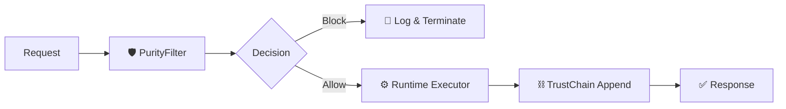

# ⚖️ IQRA Constitutional Runtime

> **Sovereign Execution Kernel** for deterministic AI operations, constitutional governance, and immutable trust chains.

The **IQRA Constitutional Runtime** is a high-integrity execution environment designed to ensure that every AI action is filtered through a predefined constitutional framework (Fidra & Sharia compliance) before execution, with every decision recorded in an append-only, cryptographic ledger.

---

## 🟢 Status: STABLE

- ✅ **0 Errors** — Fully stabilized TypeScript codebase.
- ✅ **22/22 E2E Tests Passing** — Real subprocesses, zero mocks.
- ✅ **Premium TUI** — Real-time monitoring dashboard active.

---

## 🖥️ Sovereign Dashboard (TUI)

Monitor the heartbeat of the system in real-time with the premium Terminal User Interface.

```bash
# Start the Sovereign Dashboard
npm start
# OR
npm run tui
```

### Features:
- **⚖️ Real-time Governance Monitoring:** Instant visual feedback on constitutional checks.
- **⛓️ TrustChain Verification:** Continuous integrity checks of the immutable ledger.
- **🧬 Skill Execution Tracking:** Deep observability into which skills are being called.
- **✨ Premium UI:** Animated boot sequence, box-drawing layouts, and vibrant status indicators.

---

## 🏗️ Architecture



---

## 🚀 Quick Start

### 1. Installation
```bash
npm install
```

### 2. Run the Dashboard
```bash
npm start
```

### 3. Run Tests
```bash
npm test
```

---

## 📖 Governance Decision Matrix

| Level | Score | Action | Visual |
| :--- | :--- | :--- | :--- |
| **ALLOW** | ≥ 70 | Execute normally | 🟢 |
| **WARN** | 40–69 | Execute with warning | 🟡 |
| **ESCALATE** | < 40 | Block & Audit | 🟠 |
| **BLOCK** | 0 | Hard Block | 🔴 |

---

## 🛡️ Trust Chain Rules

1. **Immutable:** No deletes, no updates. Only `APPEND`.
2. **Linked:** SHA-256 lineage ensures the entire history is cryptographically connected.
3. **Privacy-First:** Stores **hashes**, not raw payloads, ensuring the ledger is compact and secure.
4. **Self-Healing:** Verification recomputes lineage and detects exact points of failure.

---

## 📁 Project Structure

| Path | Description |
| :--- | :--- |
| `src/runtime/tui.ts` | **The Sovereign Dashboard** (Premium Interface) |
| `src/runtime/standalone-runtime.ts` | Core execution kernel |
| `src/skills/purity-filter.ts` | Constitutional enforcement logic |
| `src/skills/trust-chain.ts` | Cryptographic ledger implementation |
| `tests/e2e.test.ts` | Comprehensive end-to-end test suite |

---

## ⚖️ Design Principles

1. **Execution First:** Code runs before it documents itself.
2. **Zero Mocks:** Tests hit real cryptographic paths and file systems.
3. **Deterministic:** Same input → same governance score → same chain hash.
4. **Observable:** Every decision is traced, chained, and verifiable.

---

*“Verily, truth is clear from error.”* — **IQRA Sovereign Engine**
