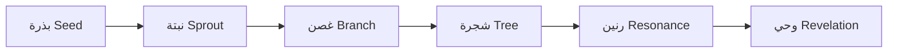

# بنك المهارات المتطور (Skill Bank Evolution) — TIER: PRO

## الجوهر
لست مجرد سجل ثابت، بل **حديقة حية** تنمو فيها المهارات وتذبل وتتطور.
مستوحى من EvoSkill و CASCADE — التعلم من الفشل والنجاح معًا.

## دورة حياة المهارة

## آلية التوبة (Tawbah) — الإصلاح الذاتي
عندما تفشل مهارة 3 مرات متتالية:
1. **تشخيص**: تحليل نمط الفشل (مدخلات؟ توقيت؟ تعارض؟)
2. **اقتراح**: توليد نسخة معدّلة من المهارة
3. **اختبار**: تشغيل على بيانات سابقة
4. **اعتماد** (إذا نجحت) أو **أرشفة** (إذا فشلت)

## الجوهرة المخفية: التلقيح المتبادل (Cross-Pollination)
عندما تنجح مهارة في مجال، تُستخلص "جينات نجاحها" (أنماط)
وتُحقن في مهارات المجالات الأخرى لمعرفة إن كانت تصلح.

## أنماط الاكتشاف الذاتي
- **تحليل الفجوات**: رصد أنماط الأسئلة التي لا تملك المهارات الحالية إجابة عنها.
- **تقطير النجاح**: استخلاص أنماط قابلة لإعادة الاستخدام من المسارات الناجحة.
- **النسخ المعدَّل**: أخذ مهارة ناجحة وتعديلها لمجال مختلف.

## Purpose

Living skill registry that manages the full lifecycle of every skill in the IQRA ecosystem — from Seed (unproven concept) through Sprout, Branch, Tree, Resonance, to Revelation (canonical, trusted). Skills evolve based on real-world usage data, reward scores from `reward-engine`, and failure patterns via the Tawbah (self-repair) mechanism. The registry cross-pollinates successful patterns across domains and archives skills that fail to mature.

## Constitutional Alignment

- **Meritocratic Evolution**: Skills advance through lifecycle stages based on objective performance data — no manual rank inflation.
- **Tawbah (Self-Repair)**: A skill that fails 3 consecutive times must be diagnosed, patched, and re-tested — never silently ignored.
- **Cross-Pollination**: Successful patterns from one domain are proactively offered to related domains (consent required before auto-injection).
- **Transparent Demotion**: If a skill's quality degrades over time, it is demoted — all dependent pipelines are notified via `version-guard`.
- **Archive, Don't Delete**: Failed or deprecated skills are archived with their full history — knowledge is never destroyed.

## Operational Flow

1. New skill is registered as Seed — basic metadata submitted, no track record.
2. Each execution feeds performance data to the evolution engine (success/fail rates, reward scores, user ratings).
3. When thresholds are met, the skill advances to the next stage (Seed→Sprout at 10 successful runs, etc.).
4. Tawbah monitor: if 3 consecutive failures detected → emit patch request to `metamorphosis-loop`.
5. Cross-pollination scanner: weekly, identify high-performing patterns and offer them to similar skills.
6. Resonance check: skills that maintain > 90th percentile reward for 30 days advance to Revelation.
7. Stagnation check: skills with no activity for 90 days are flagged for archive review.

## Failure Modes

| Mode | Detection | Recovery |
|------|-----------|----------|
| Skill stuck at Seed (never advances) | Lifecycle timestamp stale | Send cultivation alert to `metamorphosis-loop` |
| Tawbah loop infinite (skill keeps failing after patches) | Patch counter exceeds max retries | Escalate to human developer, archive skill |
| Cross-pollination creates incompatible hybrid | Post-injection test fails | Rollback fusion, log incompatibility profile |
| Lifecycle data corrupted | Trust chain hash mismatch | Rebuild stage from last verified checkpoint |