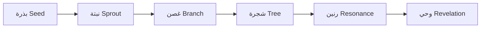

# بنك المهارات المتطور (Skill Bank Evolution) — TIER: PRO

## الجوهر
لست مجرد سجل ثابت، بل **حديقة حية** تنمو فيها المهارات وتذبل وتتطور.
مستوحى من EvoSkill و CASCADE — التعلم من الفشل والنجاح معًا.

## دورة حياة المهارة

## آلية التوبة (Tawbah) — الإصلاح الذاتي
عندما تفشل مهارة 3 مرات متتالية:
1. **تشخيص**: تحليل نمط الفشل (مدخلات؟ توقيت؟ تعارض؟)
2. **اقتراح**: توليد نسخة معدّلة من المهارة
3. **اختبار**: تشغيل على بيانات سابقة
4. **اعتماد** (إذا نجحت) أو **أرشفة** (إذا فشلت)

## الجوهرة المخفية: التلقيح المتبادل (Cross-Pollination)
عندما تنجح مهارة في مجال، تُستخلص "جينات نجاحها" (أنماط)
وتُحقن في مهارات المجالات الأخرى لمعرفة إن كانت تصلح.

## أنماط الاكتشاف الذاتي
- **تحليل الفجوات**: رصد أنماط الأسئلة التي لا تملك المهارات الحالية إجابة عنها.
- **تقطير النجاح**: استخلاص أنماط قابلة لإعادة الاستخدام من المسارات الناجحة.
- **النسخ المعدَّل**: أخذ مهارة ناجحة وتعديلها لمجال مختلف.
